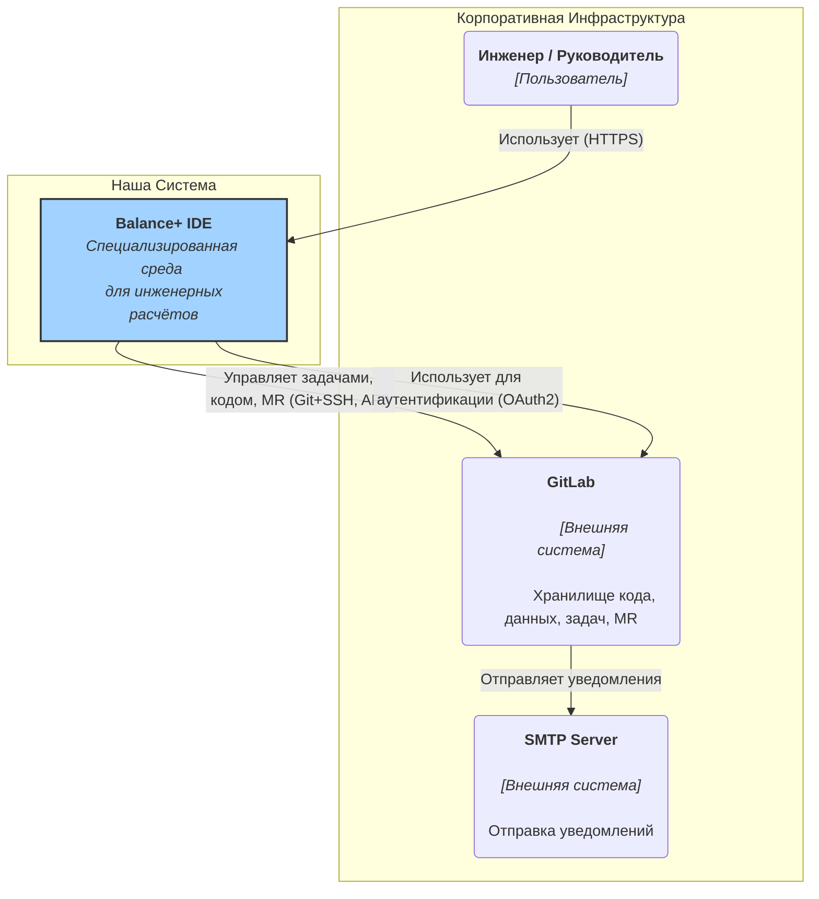

# **Архитектурное Видение и Принципы Системы "Balance+"**

**Версия:** 1.0  
**Статус:** Утверждено

## 1. Введение: Бизнес-контекст и Цели

### 1.1. Проблема

Инженерные расчёты в нашей отрасли — это сложный, итеративный процесс, требующий высокой точности. Текущий подход, основанный на ручном редактировании файлов с данными, использовании разрозненных скриптов и обмене результатами через файловые хранилища, приводит к ряду проблем:
*   **Высокий риск человеческой ошибки** при вводе и копировании данных.
*   **Отсутствие версионирования и прослеживаемости:** Трудно понять, на основе каких именно входных данных был получен тот или иной результат, и кто вносил изменения.
*   **Потеря времени** на рутинные операции и координацию между инженером-расчётчиком и руководителем.
*   **Сложность переиспользования** наработок и результатов из предыдущих проектов.

### 1.2. Решение: "Balance+ IDE"

**"Balance+ IDE"** — это не просто калькулятор, а **специализированная интегрированная среда разработки (IDE) для инженеров-расчётчиков.** Она создана, чтобы автоматизировать весь жизненный цикл расчётной задачи, обеспечивая точность, прослеживаемость и эффективность.

Система предоставляет инженерам удобный, предметно-ориентированный интерфейс для работы, при этом используя под капотом лучшие практики из мира разработки ПО, такие как Git для контроля версий и CI/CD для автоматизации процессов.

### 1.3. Целевая аудитория

*   **Инженер-расчётчик:** Основной пользователь. Выполняет расчёты, вносит изменения, анализирует результаты.
*   **Руководитель бюро/отдела расчётов:** Управляет задачами, проводит ревью (проверку) результатов, принимает финальные решения.

## 2. Ключевые архитектурные принципы

Эти принципы являются фундаментом, на котором построена вся система. Любые будущие изменения и доработки должны им соответствовать.

| Принцип | Описание | Обоснование |
| :--- | :--- | :--- |
| **Git-Centric: GitLab — единый источник правды** | Все данные проекта (код, входные параметры, геометрии, результаты), а также процессы (задачи, ревью) хранятся и управляются в GitLab. | Обеспечивает полную прослеживаемость, версионирование и атомарность изменений. Исключает проблемы рассинхронизации между разными хранилищами. |
| **"Balance+ IDE" — это специализированный UI, а не замена GitLab** | Наше приложение не дублирует функции GitLab (управление пользователями, задачами, MR), а предоставляет удобный интерфейс для **специфических инженерных задач**: визуального редактирования данных и запуска расчётов. | Фокусируемся на создании уникальной ценности, а не на изобретении велосипеда. Максимально используем мощь готовой, проверенной платформы. |
| **Асинхронная микросервисная архитектура** | Система разделена на независимые, слабо связанные сервисы. Длительные расчёты выполняются асинхронно с использованием брокера сообщений (RabbitMQ) и `Celery`. | Обеспечивает отказоустойчивость (сбой одного сервиса не валит всю систему), масштабируемость (можно добавить больше расчётных worker'ов) и простоту поддержки. |
| **Паттерн "Сага" для сложных бизнес-процессов** | Многошаговые, комплексные расчёты (как "Расчёт Баланса") управляются как единый, долгоживущий процесс, который может быть приостановлен для получения данных от пользователя. | Гарантирует надёжное и консистентное выполнение сложных операций, даже если они занимают много времени и требуют интерактива. |
| **"Docs as Code": Документация живёт вместе с кодом** | Вся архитектурная и техническая документация хранится в этом же репозитории в формате Markdown и проходит ревью через Merge Requests. | Гарантирует, что документация всегда актуальна и соответствует коду. Делает знания доступными для всей команды. |

## 3. Общая архитектура системы (C4 Model - Level 1: System Context)

На самом высоком уровне система "Balance+" взаимодействует со следующими акторами и системами:

| Элемент | Описание |
| :--- | :--- |
| **Инженер / Руководитель** | Конечный пользователь, который взаимодействует с системой через веб-интерфейс "Balance+ IDE". |
| **"Balance+ IDE"** | Наша система. Предоставляет UI для работы, управляет расчётами и автоматизирует взаимодействие с GitLab. |
| **GitLab** | Внешняя, но критически важная система. Является "сердцем" и хранилищем всех данных и процессов. Наша система выступает в роли клиента для GitLab. |
| **SMTP Server** | Внешний почтовый сервер, который используется GitLab для отправки уведомлений о задачах, MR и т.д. |
