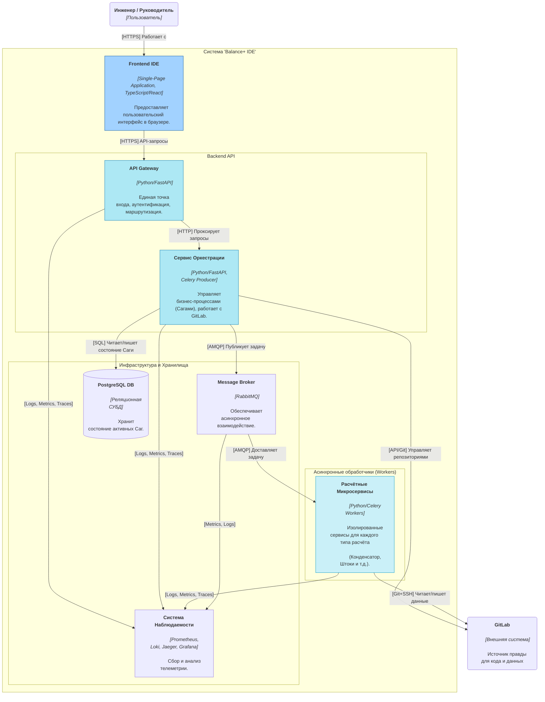

# **Архитектура Системы "Balance+" (C4 Model - Level 2: Контейнеры)**

**Версия:** 1.0  
**Статус:** Утверждено

## 1. Введение

Этот документ детализирует внутреннее устройство системы "Balance+ IDE". Он представляет архитектуру на уровне "Контейнеров" в соответствии с моделью C4.

Под "Контейнером" здесь понимается отдельная развертываемая единица (deployable unit), такая как:
*   Веб-приложение на стороне клиента (SPA).
*   Backend-микросервис (например, Docker-контейнер).
*   Хранилище данных (например, база данных).
*   Система обмена сообщениями (брокер очередей).

Эта диаграмма отвечает на вопросы: "Из каких основных блоков состоит система?", "Какова их ответственность?" и "Как они общаются друг с другом?".

## 2. Диаграмма Контейнеров

## 3. Описание компонентов

| Контейнер | Описание | Технологии |
| :--- | :--- | :--- |
| **Frontend IDE** | Клиентское SPA-приложение, работающее в браузере пользователя. Отвечает за весь пользовательский интерфейс, визуализацию данных и взаимодействие с Backend API. | TypeScript, React |
| **API Gateway** | Единственная точка входа для Frontend. Выполняет аутентификацию (валидацию JWT-токенов от GitLab), логирование и маршрутизацию запросов к внутренним сервисам. Выступает в роли фасада. | Python, FastAPI |
| **Сервис Оркестрации** | "Мозг" системы. Реализует сложную бизнес-логику (Саги). Управляет состоянием долгоживущих процессов, взаимодействует с GitLab API и отправляет асинхронные задачи на выполнение. | Python, FastAPI, Celery (как Producer) |
| **Расчётные Микросервисы** | Пул независимых `worker`-сервисов. Каждый `worker` отвечает за один конкретный тип расчёта. Они "слушают" свою очередь в брокере, выполняют вычисления и сохраняют результат в Git. | Python, Celery (как Worker) |
| **PostgreSQL DB** | Персистентное хранилище, используемое **только** Сервисом Оркестрации для сохранения состояния активных Саг. Это позволяет восстанавливать прерванные процессы после сбоя. | PostgreSQL |
| **Message Broker** | Обеспечивает асинхронную коммуникацию. Оркестратор публикует в него задачи, а `worker`'ы их забирают. Это развязывает компоненты и повышает отказоустойчивость. | RabbitMQ |
| **Система Наблюдаемости** | Комплекс инструментов для сбора, хранения и визуализации метрик, логов и трейсов со всех компонентов системы. | Prometheus, Loki, Jaeger, Grafana |

## 4. Поток данных: Сценарий "Запуск расчёта"

Чтобы проиллюстрировать взаимодействие, рассмотрим упрощенный поток данных при запуске пользователем одного из расчётов:

1.  **Пользователь** нажимает кнопку "Рассчитать" в **Frontend IDE**.
2.  **Frontend IDE** отправляет API-запрос (HTTPS) на **API Gateway**.
3.  **API Gateway** валидирует токен пользователя, добавляет заголовки для трассировки и проксирует запрос на **Сервис Оркестрации**.
4.  **Сервис Оркестрации**:
    a. Начинает бизнес-процесс (Сагу).
    b. Сохраняет/обновляет состояние Саги в своей **PostgreSQL DB**.
    c. Через API **GitLab** создает коммит с входными данными.
    d. Публикует сообщение-задачу в **Message Broker (RabbitMQ)**.
5.  **Расчётный Микросервис (Worker)**, подписанный на нужную очередь, забирает сообщение из **RabbitMQ**.
6.  **Worker**:
    a. Клонирует/обновляет репозиторий из **GitLab**.
    b. Выполняет вычисления.
    c. Создает новый коммит с результатами и отправляет его в **GitLab**.
7.  **На протяжении всего процесса** все сервисы отправляют логи, метрики и трейсы в **Систему Наблюдаемости**.
