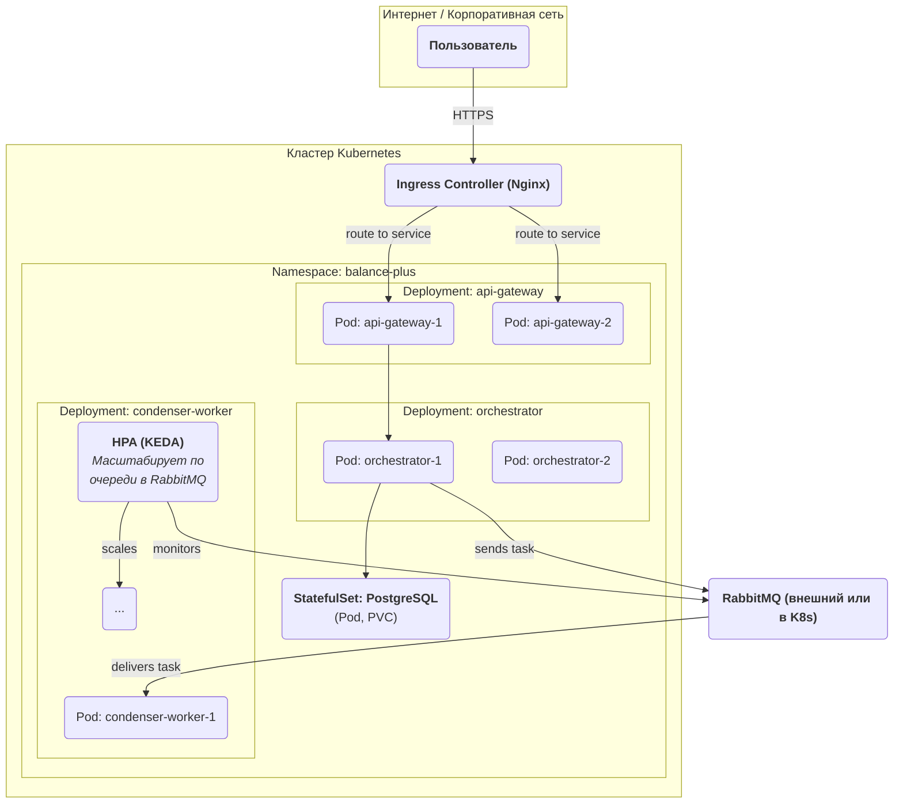

# **Описание Платформы: Оркестрация Контейнеров**

**Версия:** 1.0  
**Статус:** Утверждено  
**Владелец:** Команда Платформы / DevOps

## 1. Роль и ответственность

Платформа Оркестрации Контейнеров — это среда выполнения (runtime environment) для всех микросервисов системы "Balance+". Она отвечает за автоматизацию развертывания, масштабирования, управления и сетевого взаимодействия контейнеризированных приложений.

Ключевые задачи, решаемые Платформой:
*   **Развертывание и управление жизненным циклом:** Запуск, остановка, перезапуск и обновление сервисов без ручного вмешательства.
*   **Масштабирование:** Автоматическое увеличение или уменьшение количества экземпляров сервиса в зависимости от нагрузки.
*   **Отказоустойчивость (Self-healing):** Автоматический перезапуск отказавших контейнеров.
*   **Обнаружение сервисов (Service Discovery) и Сеть:** Обеспечение того, чтобы сервисы могли находить друг друга и общаться в защищенной сети.
*   **Управление конфигурациями и секретами:** Безопасная доставка конфигурационных данных и секретов в приложения.

## 2. Анализ архитектурных подходов и выбор технологии

**2.1. Сравнительный анализ технологий:**

*   **Docker Compose (на одной машине):**
    *   **Описание:** Простой инструмент для определения и запуска многоконтейнерных приложений на одном хосте.
    *   **Плюсы:** Крайне прост в освоении и использовании. Идеален для локальной разработки и очень простых развертываний.
    *   **Минусы:** **Не является оркестратором.** Не поддерживает кластеризацию (работает на одном узле), нет автоматического self-healing, нет встроенного автомасштабирования. **Непригоден для production-среды.**

*   **Docker Swarm:**
    *   **Описание:** "Родной" инструмент кластеризации и оркестрации от Docker.
    *   **Плюсы:** Значительно проще в настройке и управлении, чем Kubernetes. Низкий порог входа для команд, уже знакомых с Docker.
    *   **Минусы:** Менее функционален и гибок, чем Kubernetes. Экосистема (инструменты для мониторинга, сети, безопасности) гораздо менее развита. Постепенно уступает позиции Kubernetes.

*   **Kubernetes (K8s):**
    *   **Описание:** Де-факто промышленный стандарт для оркестрации контейнеров. Это мощная, гибкая платформа, поддерживаемая огромным сообществом.
    *   **Плюсы:** **Максимальная функциональность и гибкость.** Огромная экосистема инструментов для решения любых задач (сеть, безопасность, мониторинг, CI/CD). Поддерживается всеми облачными провайдерами.
    *   **Минусы:** **Высокая сложность.** Требует значительных знаний для правильной настройки и эксплуатации.

**2.2. Архитектурная рекомендация:**

**Однозначно рекомендуется использовать Kubernetes (K8s).**
Несмотря на его сложность, для построения надежной, масштабируемой и готовой к будущему развитию промышленной системы, альтернатив у Kubernetes нет. Инвестиции в его изучение и внедрение окупаются за счет стабильности и мощи, которую он предоставляет. Наша сложная микросервисная архитектура с асинхронными worker'ами и высокими требованиями к надежности идеально ложится на возможности Kubernetes.

## 3. Требования к конфигурации и управлению приложениями

### 3.1. Управление манифестами (Package Management)

*   **TR-K8S-1 (Инструмент):** Для управления K8s-манифестами **должен** использоваться **Helm**. Он позволяет пакетировать приложения (создавать "чарты") и управлять их конфигурацией через один файл `values.yaml`.
*   **TR-K8S-2 (Шаблонизация):** Должны быть созданы **шаблонные (library) Helm-чарты** для каждого типа наших микросервисов:
    *   `python-fastapi-service`: Шаблон для синхронных API-сервисов (API Gateway, Оркестратор).
    *   `python-celery-worker`: Шаблон для асинхронных worker'ов.
    *   `frontend-spa`: Шаблон для развертывания Frontend-приложения.
    Это позволит разворачивать новый сервис, просто описав его уникальные параметры в `values.yaml`, а не копируя сотни строк boilerplate-кода.

### 3.2. Управление ресурсами

*   **TR-K8S-3 (Requests и Limits):** Для **каждого** контейнера в production-среде **должны** быть определены `resources.requests` (гарантированное количество ресурсов) и `resources.limits` (максимально допустимое). Это критически важно для стабильности кластера.
*   **TR-K8S-4 (Quality of Service):** Все production-сервисы должны запускаться с классом QoS `Guaranteed` или `Burstable`. Запуск с `BestEffort` (без указания `requests`) запрещен.

### 3.3. Масштабирование

*   **TR-K8S-5 (Горизонтальное автомасштабирование - HPA):**
    *   Для **API-сервисов** (API Gateway, Оркестратор) должен быть настроен `HorizontalPodAutoscaler` на основе метрик CPU и/или Memory.
    *   Для **Celery-worker'ов** должен быть настроен HPA на основе длины очереди в RabbitMQ. Для этого используется инструмент **KEDA (Kubernetes Event-driven Autoscaling)**, который позволяет масштабировать поды на основе внешних метрик.

### 3.4. Сетевое взаимодействие и безопасность

*   **TR-K8S-6 (Входящий трафик - Ingress):** Весь HTTP(S) трафик извне кластера должен поступать через **Ingress Controller** (например, `nginx-ingress-controller`). Прямой проброс портов через `NodePort` или `LoadBalancer` для сервисов запрещен, кроме случаев, когда это технически необходимо.
*   **TR-K8S-7 (Сетевые политики - Network Policies):** По умолчанию, в production-пространстве имен (namespace) должен действовать принцип **"запрещено всё, что не разрешено"**. Сетевые политики должны явно разрешать трафик только между теми сервисами, которым это необходимо (например, разрешить API Gateway обращаться к Оркестратору, но запретить ему прямой доступ к БД).

### 3.5. Управление конфигурациями и секретами

*   **TR-K8S-8 (Конфигурации):** Конфигурационные данные, не являющиеся секретными, должны передаваться в поды через `ConfigMaps`.
*   **TR-K8S-9 (Секреты):**
    *   Секреты (пароли, токены) должны храниться в **Kubernetes Secrets**.
    *   Для безопасного управления секретами в Git-репозитории (GitOps) рекомендуется использовать инструменты шифрования, такие как **Sealed Secrets** или интеграцию с **HashiCorp Vault**. Прямое хранение base64-кодированных секретов в Git запрещено.

## 4. Диаграмма развертывания (Deployment Diagram - Пример)

Эта диаграмма показывает, как наши сервисы будут развернуты в кластере Kubernetes.

