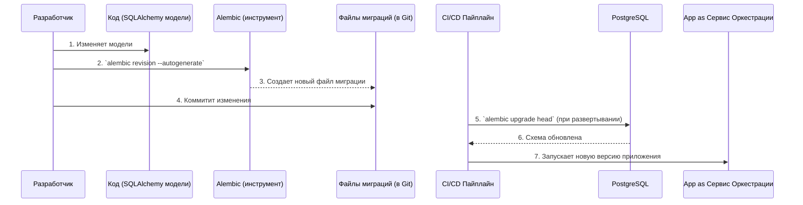

# **Описание Платформы: Управление Данными и Схемами**

**Версия:** 1.0  
**Статус:** Утверждено  
**Владелец:** Команда Платформы / Backend

## 1. Роль и ответственность

Этот документ определяет стандарты и процедуры для управления схемами и данными в двух ключевых хранилищах системы "Balance+":
1.  **GitLab:** Как персистентное хранилище для инженерных данных (JSON-файлы).
2.  **PostgreSQL:** Как персистентное хранилище для состояний Саг Сервиса Оркестрации.

Цель документа — обеспечить **предсказуемость, консистентность и управляемость** данных на протяжении всего их жизненного цикла.

## 2. Управление данными в GitLab (Инженерные данные)

**Принцип:** GitLab является **единым источником правды** для всех инженерных данных. Структура этих данных определяется через **"Контракты Данных"** в виде JSON-файлов.

### 2.1. Валидация и документирование схем JSON

*   **TR-DATA-1 (Источник правды для схем):** **Pydantic-модели** в коде соответствующих микросервисов являются **единственным источником правды** для структуры JSON-файлов. Например, структура `condenser_input.json` определяется Pydantic-моделью в коде `CondenserCalculationService`.
*   **TR-DATA-2 (Валидация):** Каждый сервис, читающий JSON-файл, **обязан** валидировать его содержимое на соответствие своей Pydantic-модели при запуске. Это гарантирует, что сервис не упадет из-за неожиданного формата данных.
*   **TR-DATA-3 (Документация схем):** В CI/CD пайплайн **должен** быть встроен этап, который автоматически генерирует **JSON Schema** из Pydantic-моделей и публикует их как артефакты. Это позволяет:
    *   Иметь всегда актуальную, машиночитаемую документацию по форматам данных.
    *   (В будущем) Использовать эти схемы для валидации на стороне Frontend IDE перед отправкой данных.

### 2.2. Управление версиями схем

*   **TR-DATA-4 (Версионирование):** Каждый корневой JSON-файл (`*_input.json`, `*_results.json`, `*_geometry.json`) **должен** содержать поле `schema_version` (например, `"schema_version": "1.0"`).
*   **TR-DATA-5 (Обратная совместимость):** При внесении **ломающих изменений** в схему (например, переименование обязательного поля):
    1.  Версия схемы в Pydantic-модели и в генерируемой JSON Schema увеличивается (например, с "1.0" до "2.0").
    2.  Код сервиса **должен** поддерживать чтение данных как минимум **предыдущей версии схемы**, реализуя логику миграции "на лету" при парсинге.
    3.  Новые файлы всегда сохраняются в последней версии схемы.
    Это обеспечивает плавный переход и предотвращает отказ системы при работе со старыми данными.

## 3. Управление данными в PostgreSQL (Состояния Саг)

**Принцип:** Схема реляционной базы данных Сервиса Оркестрации управляется **строго через код** с помощью механизма миграций. Прямые изменения схемы в БД (`ALTER TABLE ...`) категорически запрещены.

### 3.1. Технология и процесс миграций

*   **TR-DATA-6 (Инструмент):** Для управления миграциями схемы БД **должна** использоваться библиотека **Alembic**, интегрированная с **SQLAlchemy**.
*   **TR-DATA-7 (Хранение миграций):** Файлы миграций (Python-скрипты) являются частью кодовой базы Сервиса Оркестрации и версионируются в Git. Это обеспечивает полную прослеживаемость изменений схемы.
*   **TR-DATA-8 (Процесс создания миграции):**
    1.  Разработчик изменяет модели SQLAlchemy в коде.
    2.  С помощью команды `alembic revision --autogenerate` создается новый файл миграции.
    3.  Разработчик проверяет сгенерированный скрипт и коммитит его вместе с изменениями в моделях.
*   **TR-DATA-9 (Процесс применения миграций):**
    *   Применение миграций (`alembic upgrade head`) **должно** быть встроено в CI/CD пайплайн развертывания Сервиса Оркестрации.
    *   Миграции должны применяться **до** запуска новой версии приложения. Это гарантирует, что код всегда будет работать с актуальной схемой.

### Диаграмма процесса миграции

## 4. Резервное копирование и восстановление

*   **TR-DATA-10 (Цели):**
    *   **RPO (Recovery Point Objective):** Допустимая потеря данных — не более 1 часа.
    *   **RTO (Recovery Time Objective):** Время восстановления сервиса после сбоя — не более 30 минут.
*   **TR-DATA-11 (PostgreSQL):**
    *   Должна быть настроена система **Point-In-Time Recovery (PITR)**. Это включает в себя регулярные полные бэкапы (например, раз в сутки) и непрерывное архивирование журналов транзакций (WAL).
    *   Инструмент: `pgBackRest` или аналогичный.
*   **TR-DATA-12 (GitLab):**
    *   Должны быть настроены регулярные полные бэкапы всего экземпляра GitLab с помощью встроенной утилиты `gitlab-backup`.
*   **TR-DATA-13 (Тестирование восстановления):** Процедура восстановления из бэкапов **должна** регулярно (не реже раза в квартал) тестироваться на staging-окружении для подтверждения их работоспособности.
