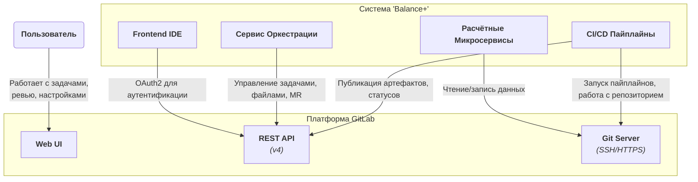

# **Описание Платформы: Интеграция с GitLab**

**Версия:** 1.0  
**Статус:** Утверждено  
**Владелец:** Команда Платформы / DevOps

## 1. Роль в архитектуре "Balance+"

GitLab не является компонентом, который мы разрабатываем, но он выполняет роль **фундаментального, системообразующего сервиса**. В нашей архитектуре GitLab — это **единый источник правды (Single Source of Truth)** для следующих сущностей:

1.  **Исходный код:** Все микросервисы хранятся в моно-репозитории.
2.  **Инженерные данные:** Все входные данные, геометрии и результаты расчётов хранятся как JSON-файлы непосредственно в Git.
3.  **Задачи и Процессы:** Весь жизненный цикл разработки и расчёта управляется через нативные сущности GitLab:
    *   **Задачи (Issues):** для постановки и отслеживания работы.
    *   **Ветки (Branches):** для изоляции изменений.
    *   **Запросы на слияние (Merge Requests):** для проведения ревью (проверки) результатов.
4.  **Аутентификация и Авторизация:** GitLab является единственным провайдером учетных записей для пользователей системы "Balance+".
5.  **CI/CD:** Встроенный GitLab CI используется для автоматизации сборки, тестирования и развертывания всех компонентов системы.

Наша система "Balance+" по сути является **специализированным клиентом-оркестратором** для GitLab, который автоматизирует и упрощает специфические инженерные рабочие процессы.

## 2. Модель взаимодействия (Интерфейсы)

Наша система взаимодействует с GitLab по трем основным каналам:



| Канал | Кто использует | Для чего |
| :--- | :--- | :--- |
| **Git Server (SSH)** | **Расчётные Микросервисы (Workers)**, **CI/CD Пайплайны** | Для выполнения стандартных Git-операций: `clone`, `checkout`, `commit`, `push`. Это основной канал для работы с файлами данных. |
| **REST API (v4)** | **Сервис Оркестрации**, **Frontend IDE** | Для управления метаданными и процессами: создание/чтение `Issues`, `Merge Requests`, управление ветками, аутентификация пользователей (OAuth2). |
| **Web UI** | **Пользователи (Инженеры, Руководители)** | Для выполнения задач, которые не автоматизированы в нашем приложении: создание и детальная атрибуция `Issues`, проведение Code Review в `Merge Requests`, управление настройками проекта. |

## 3. Соглашения и стандарты использования

Чтобы обеспечить порядок и предсказуемость, все команды должны придерживаться следующих соглашений.

### 3.1. Структура репозитория

*   **TR-GIT-1 (Моно-репозиторий):** Все сервисы, документация и конфигурации хранятся в одном Git-репозитории.
    ```
    /
    ├── docs/              # Вся архитектурная документация
    ├── services/          # Исходный код микросервисов
    │   ├── api-gateway/
    │   ├── orchestrator/
    │   └── workers/
    │       └── condenser/
    ├── frontend/          # Исходный код Frontend IDE
    └── ...
    ```
*   **TR-GIT-2 (Хранение данных):** Инженерные данные (геометрии) хранятся в стандартизированных директориях в `main` ветке.
    ```
    /
    ├── project-a/
    │   ├── geometries/
    │   │   ├── condensers/
    │   │   └── valves/
    │   └── geometries_manifest.json # Индексный файл
    └── ...
    ```

### 3.2. Стратегия ветвления (GitLab Flow)

*   **TR-GIT-3:** Основной веткой является `main`. Она всегда должна быть в стабильном, готовом к развертыванию состоянии.
*   **TR-GIT-4:** Вся новая работа (фичи, багфиксы, расчёты) ведется в **отдельных ветках**, создаваемых от `main`.
*   **TR-GIT-5 (Именование веток):** Ветки, связанные с задачами-`Issues`, именуются по шаблону `issue/<issue-id>-<short-description>` (например, `issue/42-condenser-calculation`). Это обеспечивает автоматическую привязку коммитов и MR к задаче в GitLab.
*   **TR-GIT-6:** Изменения попадают в `main` **только** через `Merge Request`. Прямые коммиты в `main` запрещены.

### 3.3. Процесс ревью (Merge Requests)

*   **TR-GIT-7:** Каждый `Merge Request` должен иметь как минимум одного `approver`'а (ревьюера).
*   **TR-GIT-8:** Слияние (Merge) MR возможно **только** после успешного прохождения CI-пайплайна.
*   **TR-GIT-9:** Для инженерных расчётов, ревью в MR является формальным процессом утверждения результатов руководителем.

### 3.4. Управление задачами (Issues)

*   **TR-GIT-10:** Каждая рабочая задача (как разработка, так и инженерный расчёт) **должна** быть заведена как `Issue` в GitLab.
*   **TR-GIT-11:** Для классификации задач должны использоваться **метки (Labels)** (например, `bug`, `feature`, `calculation`, `service:orchestrator`).

## 4. Требования к эксплуатации (для администраторов GitLab)

*   **TR-PL-GIT-1 (Резервное копирование):** Должны быть настроены регулярные, полные бэкапы всего экземпляра GitLab. Политика хранения бэкапов — не менее 30 дней.
*   **TR-PL-GIT-2 (Мониторинг):** Состояние здоровья GitLab (CPU, RAM, диск, производительность фоновых задач) должно отслеживаться через встроенные инструменты или Prometheus exporter.
*   **TR-PL-GIT-3 (CI/CD Runners):** Должен быть настроен и поддерживаться пул **GitLab Runner**'ов, необходимых для выполнения наших CI/CD пайплайнов.
*   **TR-PL-GIT-4 (Безопасность):**
    *   Регистрация новых пользователей должна быть ограничена (только по приглашению администратора).
    *   Должны быть настроены `push rules` для защиты `main` ветки от случайных коммитов или `force push`.
    *   Регулярное обновление GitLab до последних стабильных версий для получения патчей безопасности.
