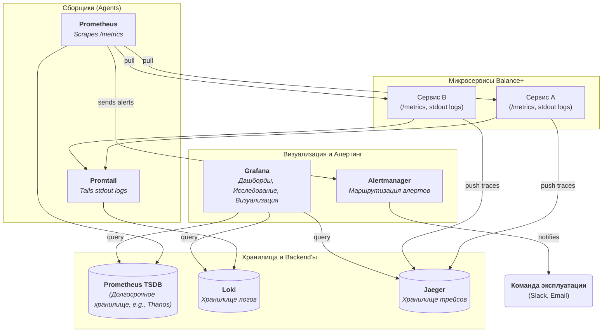

# **Описание Платформы: Система Наблюдаемости**

**Версия:** 1.0  
**Статус:** Утверждено  
**Владелец:** Команда Платформы / DevOps

## 1. Роль и ответственность

Система Наблюдаемости (Observability Stack) представляет собой интегрированный комплекс инструментов и стандартов, предназначенный для сбора, хранения, анализа и визуализации телеметрических данных со **всех** компонентов платформы "Balance+".

Её основная задача — дать ответ на вопрос **"Почему система ведет себя так, а не иначе?"**. В отличие от простого мониторинга, который отвечает на вопрос "Работает ли система?", наблюдаемость позволяет исследовать неизвестные ранее проблемы и аномалии.

Платформа основана на **"трёх столпах наблюдаемости"**:
1.  **Метрики (Metrics):** Агрегированные числовые данные о состоянии системы (например, количество ошибок в минуту, среднее время отклика). Отвечают на вопрос **"Что происходит?"**.
2.  **Логи (Logs):** Детальные, структурированные записи о конкретных событиях в системе. Отвечают на вопрос **"Почему это произошло?"** на уровне одного компонента.
3.  **Трейсы (Traces):** Сквозная "карта путешествия" одного запроса через все микросервисы. Отвечают на вопрос **"Где в системе возникла проблема/задержка?"**.

## 2. Технологический стек и обоснование

**Архитектурная рекомендация:** Использовать **стек Prometheus + Loki + Jaeger + Grafana (PLJG)**.

**Обоснование:**
*   **Экосистема Cloud Native:** Этот стек является де-факто стандартом для мониторинга систем, развернутых в Kubernetes. Инструменты нативно интегрируются друг с другом и с платформой оркестрации.
*   **Ресурсоэффективность:** Связка Prometheus + Loki значительно менее требовательна к ресурсам (особенно к RAM и диску), чем альтернативы вроде стека ELK, что снижает стоимость владения.
*   **Единый интерфейс:** Grafana предоставляет мощный "единый пульт управления" для визуализации метрик, логов и трейсов, позволяя бесшовно переключаться между ними в процессе анализа инцидентов.

### Диаграмма стека

## 3. Стандарты и требования для микросервисов ("Контракт наблюдаемости")

Каждый микросервис, разрабатываемый в рамках проекта "Balance+", **обязан** соответствовать следующим требованиям.

### 3.1. Метрики (Metrics)

*   **TR-OBS-1 (Экспорт метрик):** Каждый сервис **должен** предоставлять HTTP-эндпоинт `/metrics` с метриками в формате Prometheus.
*   **TR-OBS-2 (Стандартные метрики "RED"):** Каждый **API-сервис** (API Gateway, Оркестратор) должен экспортировать:
    *   **Rate:** `http_requests_total` (счетчик запросов с лейблами `method`, `path`, `status_code`).
    *   **Errors:** (реализуется через `status_code` в `http_requests_total`).
    *   **Duration:** `http_request_duration_seconds` (гистограмма времени ответа).
*   **TR-OBS-3 (Стандартные метрики "USE" для Workers):** Каждый **Celery-worker** должен экспортировать:
    *   **Utilization:** `celery_tasks_total` (счетчик задач с лейблами `task_name`, `status`).
    *   **Saturation:** Длина очереди в RabbitMQ (собирается с самого брокера).
    *   **Errors:** (реализуется через `status` в `celery_tasks_total`).

### 3.2. Логи (Logs)

*   **TR-OBS-4 (Формат):** Все сервисы **должны** писать логи в `stdout` в **структурированном JSON-формате**.
*   **TR-OBS-5 (Обязательные поля):** Каждая запись лога **должна** содержать минимальный набор полей:
    *   `timestamp`: Время события в формате ISO 8601.
    *   `level`: Уровень лога (`INFO`, `WARNING`, `ERROR`, `DEBUG`).
    *   `service`: Имя сервиса (например, `condenser-worker`).
    *   `message`: Текстовое описание события.
    *   `correlationId`: **Обязательно.** Идентификатор трассировки для связи с другими логами и трейсами.
*   **TR-OBS-6 (Уровни логирования):**
    *   `INFO`: Стандартный уровень для production. Логируются ключевые события жизненного цикла (старт/стоп сервиса, начало/конец обработки задачи).
    *   `ERROR`: Логируются все перехваченные исключения и ошибки.
    *   `DEBUG`: Используется для подробной отладочной информации, в production должен быть отключен по умолчанию, но с возможностью включения через переменную окружения.

### 3.3. Трейсы (Traces)

*   **TR-OBS-7 (Проброс контекста):** **Все** сервисы **должны** поддерживать проброс контекста трассировки (стандарт W3C Trace Context).
    *   API Gateway **генерирует** `traceId` и передает его дальше в HTTP-заголовке `traceparent`.
    *   Оркестратор **принимает** `traceparent` из HTTP-запроса и **внедряет** его в заголовки сообщения, отправляемого в RabbitMQ.
    *   Worker-сервисы **извлекают** `traceparent` из заголовков сообщения RabbitMQ.
*   **TR-OBS-8 (Создание спанов):** Сервисы должны создавать "спаны" (spans), оборачивая ими все значимые операции:
    *   Входящий HTTP-запрос.
    *   Запрос к базе данных.
    *   Вызов API другого сервиса (например, GitLab).
    *   Публикация сообщения в очередь.
    *   Выполнение длительного вычисления.
*   **TR-OBS-9 (Интеграция с логами):** Идентификатор `traceId` из контекста трассировки **должен** дублироваться в поле `correlationId` всех логов, записанных в рамках этого трейса.

## 4. Требования к платформе

*   **TR-PL-1 (Сбор логов и метрик):** Prometheus и Promtail должны быть настроены на автоматическое обнаружение и сбор телеметрии со всех новых сервисов, разворачиваемых в Kubernetes (с помощью стандартных аннотаций K8s).
*   **TR-PL-2 (Визуализация):** Должны быть созданы **шаблонные дашборды в Grafana** для каждого типа сервиса (API-сервис, Celery-worker), которые будут автоматически создаваться для новых сервисов.
*   **TR-PL-3 (Алертинг):** Должен быть развернут и сконфигурирован **Alertmanager**. Необходимо настроить базовые правила алертинга (см. ТЗ на RabbitMQ) и правила для сервисов (например, высокий `error rate`, низкий `availability`).
*   **TR-PL-4 (Хранение данных):** Должна быть определена и настроена политика хранения данных (retention policy) для метрик и логов.

Этот документ устанавливает единые стандарты для всех разработчиков, гарантируя, что любой новый сервис будет "прозрачным" и наблюдаемым с первого дня своего существования.
