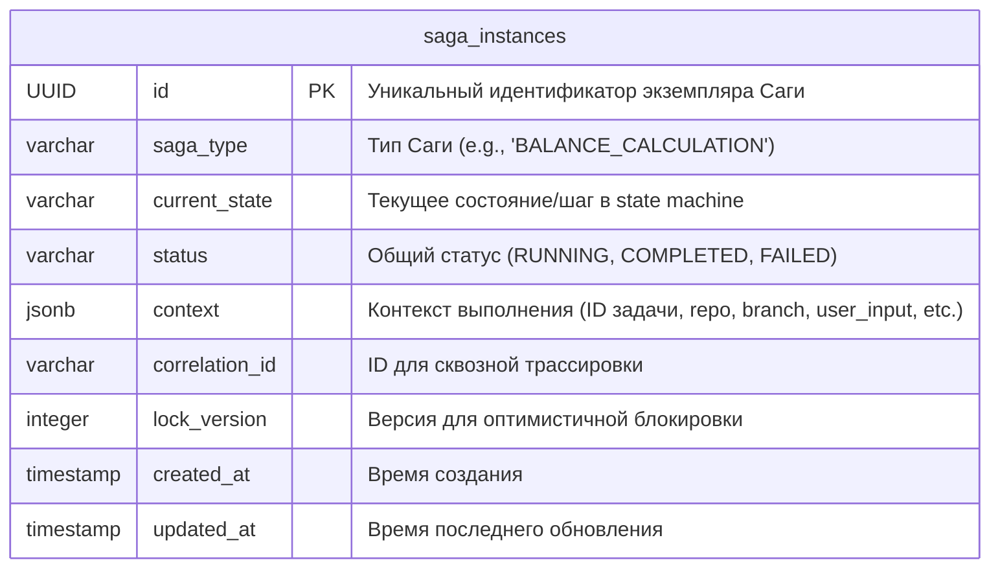
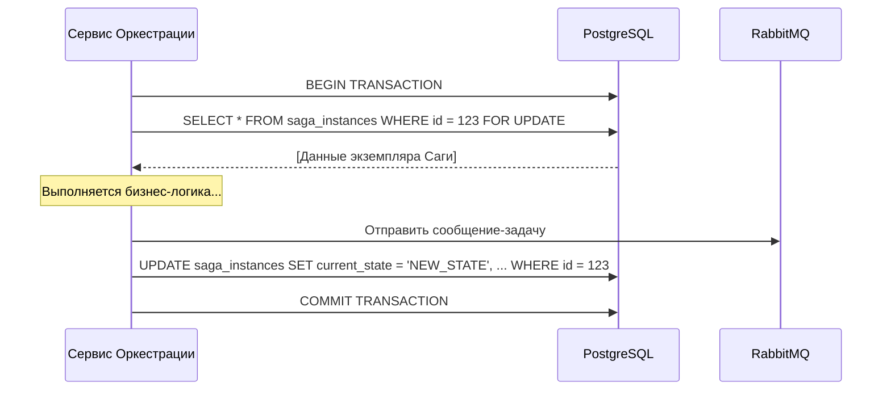

# **Описание Платформы: База Данных PostgreSQL**

**Версия:** 1.0  
**Статус:** Утверждено  
**Владелец:** Команда Платформы / DevOps

## 1. Роль и ответственность

База данных PostgreSQL в архитектуре "Balance+" выполняет **одну, строго определенную и критически важную функцию**: она является **персистентным хранилищем состояний (State Store)** для **Сервиса Оркестрации Задач**.

Её ключевые задачи:
*   **Обеспечение отказоустойчивости:** Хранение информации о каждом запущенном экземпляре долгоживущего процесса (Саги), включая его текущий шаг и контекст. Это позволяет Оркестратору возобновлять прерванные процессы после сбоя или перезапуска.
*   **Гарантия консистентности:** Использование транзакций для атомарного обновления состояния Саги. Например, операция "отправить задачу в RabbitMQ и изменить статус Саги" должна либо полностью выполниться, либо полностью откатиться.

**Важно:** Эта база данных **не предназначена** для хранения бизнес-данных, таких как входные параметры, геометрии или результаты расчётов. Все эти артефакты хранятся исключительно в GitLab.

## 2. Анализ архитектурных подходов и выбор технологии

**2.1. Сравнительный анализ технологий:**

*   **PostgreSQL (Реляционная СУБД):**
    *   **Описание:** Зрелая, надежная реляционная база данных с полной поддержкой ACID-транзакций.
    *   **Плюсы:** **Гарантии ACID** — это ключевое требование для надежного управления состоянием. Транзакционная целостность "из коробки". Мощный SQL для сложных запросов (например, найти все "зависшие" процессы). Отличная поддержка в экосистеме Python (SQLAlchemy, Alembic). Поддержка JSONB позволяет гибко хранить контекст Саги.
    *   **Минусы:** Может показаться избыточной для простой задачи хранения состояний, однако её надежность полностью оправдывает использование.

*   **Redis (In-memory Key-Value Store):**
    *   **Описание:** Высокопроизводительное хранилище в оперативной памяти с опциональной персистентностью.
    *   **Плюсы:** Чрезвычайно высокая скорость.
    *   **Минусы:** **Недостаточные гарантии транзакционности и персистентности** по сравнению с PostgreSQL. Восстановление после сбоя менее надежно. Больше подходит для кэширования или простых очередей, чем для хранения критически важного состояния долгоживущих процессов.

*   **MongoDB (Документная СУБД):**
    *   **Описание:** NoSQL база данных, хранящая данные в виде JSON-подобных документов.
    *   **Плюсы:** Гибкая схема, состояние Саги естественно ложится на структуру документа.
    *   **Минусы:** Хотя MongoDB развила поддержку транзакций, они сложнее в реализации и не являются такой же "родной" и фундаментальной концепцией, как в PostgreSQL. Для нашей задачи, где целостность состояния важнее гибкости схемы, PostgreSQL является более безопасным выбором.

**2.2. Архитектурная рекомендация:**

**Однозначно рекомендуется использовать PostgreSQL.** Для управления состоянием бизнес-процессов, где каждый шаг должен быть выполнен атомарно, гарантии ACID, предоставляемые PostgreSQL, не являются опцией, а **абсолютной необходимостью**.

## 3. Логическая модель данных

Схема данных максимально проста и сфокусирована на одной задаче.

| Поле | Тип | Описание | Индекс |
| :--- | :--- | :--- | :--- |
| `id` | UUID | Первичный ключ. Используем UUID для избежания конфликтов в распределенной среде. | Да (PK) |
| `saga_type` | VARCHAR | Имя класса или тип Саги. Позволяет в будущем поддерживать разные типы процессов. | Да |
| `current_state` | VARCHAR | Ключевое поле. Имя текущего состояния в state machine (например, `AWAITING_CONDENSER_INPUT`). | Да |
| `status` | VARCHAR | Высокоуровневый статус всего процесса. Полезно для быстрого поиска. | Да |
| `context` | JSONB | Гибкое поле для хранения всех переменных, связанных с этим экземпляром Саги. | Да (GIN) |
| `correlation_id` | VARCHAR | Связывает запись с логами и трейсами в системе наблюдаемости. | Да |
| `lock_version` | INTEGER | Счетчик для реализации оптимистичных блокировок, предотвращающий race conditions при конкурентном доступе. | - |
| `created_at` | TIMESTAMP | Автоматически устанавливается при создании записи. | - |
| `updated_at` | TIMESTAMP | Автоматически обновляется при изменении записи. | - |

## 4. Требования к эксплуатации и управлению

**4.1. Надежность и отказоустойчивость (Production)**
*   **TR-DB-1 (High Availability):** В production-среде PostgreSQL должен быть развернут в **HA-конфигурации** с как минимум одной репликой (standby). Должна быть настроена автоматическая отработка отказа (failover) с помощью инструментов типа Patroni.
*   **TR-DB-2 (Резервное копирование):** Должны быть настроены регулярные бэкапы с использованием `pg_dump` или инструментов для Point-In-Time Recovery (PITR), таких как `pgBackRest`.

**4.2. Управление схемой данных**
*   **TR-DB-3 (Миграции):** **Любые изменения** схемы данных должны производиться **исключительно** через механизм миграций.
*   **TR-DB-4 (Инструмент):** Для управления миграциями в Сервисе Оркестрации должна использоваться библиотека **Alembic**. Файлы миграций являются частью кодовой базы и версионируются в Git.
*   **TR-DB-5 (CI/CD):** Процесс применения миграций должен быть встроен в CI/CD пайплайн развертывания Сервиса Оркестрации.

**4.3. Безопасность**
*   **TR-DB-6 (Доступ):** Сервис Оркестрации должен подключаться к БД под **специально выделенным пользователем** с минимально необходимыми правами (`SELECT`, `INSERT`, `UPDATE`, `DELETE`) только на свою схему/таблицы.
*   **TR--DB-7 (Сеть):** Доступ к базе данных должен быть ограничен на сетевом уровне (например, через Kubernetes Network Policies) так, чтобы к ней мог подключиться **только** Сервис Оркестрации.
*   **TR-DB-8 (Секреты):** Учетные данные для доступа к БД должны передаваться в сервис как секреты, а не в виде переменных окружения или в коде.

## 5. Паттерн взаимодействия

Сервис Оркестрации должен взаимодействовать с БД **всегда внутри транзакции** для обеспечения консистентности.

Этот паттерн (с использованием `SELECT ... FOR UPDATE` для пессимистичной блокировки) гарантирует, что даже если несколько экземпляров Оркестратора попытаются одновременно обработать одну и ту же Сагу, только один из них сможет это сделать, предотвращая повреждение данных.
