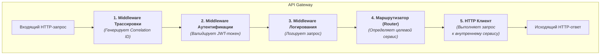
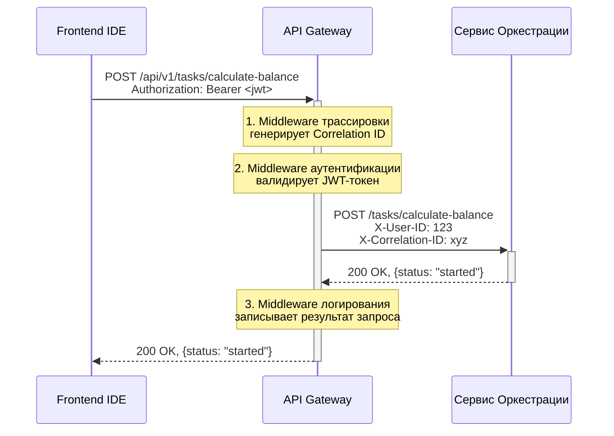

# **Описание сервиса: API Gateway**

**Версия:** 1.0  
**Статус:** Утверждено  
**Владелец:** Команда Платформы

## 1. Роль и ответственность (C4 Model - Level 3: Components)

API Gateway является **единой точкой входа** и **фасадом** для всей backend-архитектуры "Balance+". Его основная ответственность — защитить внутренние сервисы от внешнего мира и упростить взаимодействие для клиентских приложений (Frontend IDE).

Сервис является **"тонким" прокси** и не содержит бизнес-логики. Он выполняет следующие сквозные задачи (cross-cutting concerns):

*   **Аутентификация & Авторизация:** Проверяет подлинность пользователя на каждом запросе.
*   **Маршрутизация:** Направляет запросы к нужному внутреннему микросервису.
*   **Безопасность:** Обеспечивает базовую защиту от атак (Rate Limiting, CORS).
*   **Наблюдаемость:** Является точкой генерации `Correlation ID` для сквозной трассировки и логирует все входящие запросы.

### 1.1. Диаграмма компонентов

Внутренне API Gateway можно представить как конвейер (pipeline) из нескольких middleware-компонентов, через которые проходит каждый запрос.

## 2. Детальные требования

Этот раздел основан на ранее утвержденном Техническом Задании.

### 2.1. Функциональные требования

| ID | Требование | Описание |
| :--- | :--- | :--- |
| **FR-GW-1** | **Аутентификация по JWT** | Сервис должен принимать JWT-токен (полученный от GitLab) в заголовке `Authorization: Bearer <token>`. Токен должен валидироваться на каждом запросе к защищенным эндпоинтам. |
| **FR-GW-2** | **Обогащение запроса** | После успешной валидации токена, Сервис должен извлекать `user_id` и `username` и передавать их в заголовках `X-User-ID` и `X-User-Name` во внутренние сервисы. |
| **FR-GW-3** | **Маршрутизация на основе пути** | Входящие запросы должны маршрутизироваться к внутренним микросервисам на основе префикса URL. Карта маршрутизации должна быть внешней и легко изменяемой (через переменные окружения). |
| **FR-GW-4** | **Ограничение скорости (Rate Limiting)** | Должен быть реализован механизм ограничения количества запросов с одного IP-адреса для защиты от DoS-атак. |
| **FR-GW-5** | **Обработка ошибок** | Сервис должен перехватывать ошибки от внутренних сервисов (5xx) или ошибки соединения, логировать их детали и возвращать клиенту стандартизированный ответ с HTTP-статусом 500 или 504, не раскрывая внутреннюю структуру ошибки. |
| **FR-GW-6** | **CORS** | Должна быть настроена политика Cross-Origin Resource Sharing (CORS) для разрешения запросов от домена, на котором размещен Frontend IDE. |

### 2.2. Карта маршрутизации (Пример)

| Входящий путь | Целевой сервис |
| :--- | :--- |
| `/api/v1/tasks/{...}` | `http://task-orchestrator-service/` |
| `/api/v1/geometries/{...}` | `http://task-orchestrator-service/` |
| `/api/v1/analysis/{...}` | `http://analysis-service/` (если/когда он появится) |

### 2.3. Нефункциональные требования

| ID | Требование | Описание |
| :--- | :--- | :--- |
| **NF-GW-1** | **Производительность** | Дополнительная задержка (overhead), вносимая API Gateway, не должна превышать **10 мс** на 95-м перцентиле. |
| **NF-GW-2** | **Отказоустойчивость** | Сервис должен быть `stateless` и поддерживать горизонтальное масштабирование. Сбой одного из экземпляров не должен влиять на общую доступность. |

## 3. API Контракты

API Gateway **проксирует** запросы и не определяет собственные сложные контракты. Однако он является "владельцем" общего префикса `/api/v1/` и стандартов:
*   **Формат данных:** Все тела запросов и ответов должны быть в формате `application/json`.
*   **Аутентификация:** Все эндпоинты (кроме `/health` и `/docs`) требуют заголовок `Authorization: Bearer <token>`.
*   **Стандарт ошибок:** Ответы с ошибками `4xx` и `5xx` должны иметь тело следующего вида: `{"detail": "Human-readable error message"}`.

Полная спецификация доступных эндпоинтов определяется внутренними сервисами, но агрегируется и отображается в Swagger-документации API Gateway по адресу `/docs`.

## 4. Технологический стек

| Компонент | Технология | Обоснование |
| :--- | :--- | :--- |
| **Язык** | Python 3.10+ | Основной язык backend-разработки в проекте. |
| **Фреймворк** | FastAPI | Высокопроизводительный асинхронный фреймворк, идеально подходящий для I/O-bound задач, таких как проксирование. |
| **HTTP-клиент** | HTTPX | Современная асинхронная библиотека для выполнения HTTP-запросов к внутренним сервисам. |
| **Аутентификация** | `python-jose` | Для валидации JWT-токенов. |
| **Сервер** | Uvicorn + Gunicorn | Стандартная связка для запуска ASGI-приложений в production. |

## 5. Диаграмма последовательности: "Аутентифицированный запрос"

Эта диаграмма показывает, как API Gateway обрабатывает типичный запрос от Frontend к Сервису Оркестрации.

