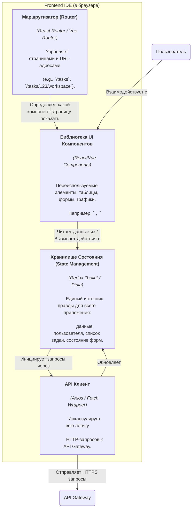
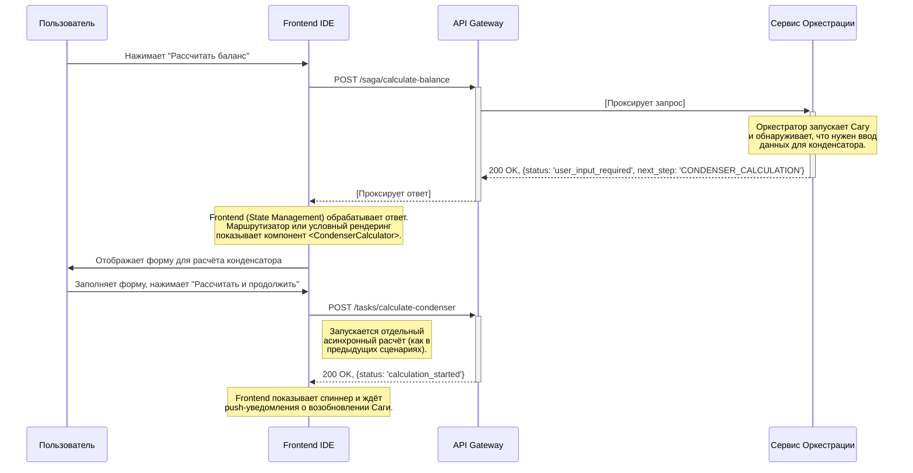

# **Описание сервиса: Frontend IDE "Balance+"**

**Версия:** 1.0  
**Статус:** Утверждено  
**Владелец:** Команда Frontend

## 1. Роль и ответственность

Frontend IDE "Balance+" — это **клиентское Single-Page Application (SPA)**, работающее в браузере пользователя. Это единственный компонент системы, с которым напрямую взаимодействует инженер или руководитель.

Его ключевая ответственность — предоставить **богатый, интерактивный и предметно-ориентированный пользовательский интерфейс**, который абстрагирует сложность backend-архитектуры.

Основные задачи:
*   **Визуализация и редактирование данных:** Отображение сложных инженерных данных (JSON-файлов) в виде удобных форм, таблиц и графиков.
*   **Управление рабочим процессом:** Направление пользователя по шагам, от выбора задачи до отправки на ревью.
*   **Оркестрация пользовательского опыта:** Динамическое изменение интерфейса в зависимости от состояния сложных процессов (Саг), управляемых на backend.
*   **Взаимодействие с API:** Является клиентом для API Gateway, отправляя все запросы на выполнение действий.

## 2. Архитектура и компоненты (C4 Model - Level 3)

Frontend — это "толстый" клиент. Его архитектуру можно представить как совокупность взаимодействующих модулей, управляемых централизованным хранилищем состояния.

| Компонент | Описание |
| :--- | :--- |
| **Библиотека UI Компонентов** | Набор "глупых" (stateless) и "умных" (stateful) компонентов, которые отвечают за отрисовку. Ключевой принцип — переиспользование (например, компонент для расчёта конденсатора используется и для отдельной задачи, и как шаг в Саге). |
| **Хранилище Состояния** | "Мозг" Frontend-приложения. Хранит все данные, необходимые для работы UI, в нормализованном виде. Компоненты подписываются на изменения в этом хранилище и перерисовываются автоматически. |
| **API Клиент** | Изолированный модуль, отвечающий за всё сетевое взаимодействие. Обрабатывает добавление JWT-токенов в заголовки, обработку ошибок API и т.д. |
| **Маршрутизатор** | Отвечает за навигацию внутри SPA, связывая URL-адреса с отображаемыми компонентами-страницами. |

## 3. Ключевые сценарии и требования

### 3.1. Функциональные требования

| ID | Требование | Описание |
| :--- | :--- | :--- |
| **FR-FE-1** | **Аутентификация через GitLab** | Приложение должно реализовывать OAuth2-поток. При входе перенаправлять пользователя на GitLab, получать JWT-токен и сохранять его для последующих запросов. |
| **FR-FE-2** | **Дашборд Задач** | Отображать список задач из GitLab, назначенных текущему пользователю, с возможностью поиска и фильтрации. |
| **FR-FE-3** | **Рабочее пространство задачи** | Предоставлять интерфейс для работы с файлами в контексте Git-ветки, связанной с задачей. |
| **FR-FE-4** | **"Умный" редактор данных** | Отображать JSON-данные в виде интерактивных, валидируемых форм и таблиц, а не как сырой текст. |
| **FR-FE-5** | **Управление Сагой** | Корректно обрабатывать ответы от Оркестратора (`status: 'user_input_required'`). Динамически отображать необходимый UI-компонент для текущего шага Саги и возобновлять процесс после его выполнения. |
| **FR-FE-6** | **Визуализация результатов** | Отображать результаты расчётов в виде таблиц и интерактивных графиков. |
| **FR-FE-7** | **"Визуальный Diff"** | Предоставлять интерфейс для сравнения двух версий (коммитов), наглядно подсвечивая изменения во входных данных и результатах. |

### 3.2. Нефункциональные требования

| ID | Требование | Описание |
| :--- | :--- | :--- |
| **NF-FE-1** | **Производительность** | Время до первого интерактивного контента (Time to Interactive) не должно превышать 3 секунды. Отклик интерфейса на действия пользователя — не более 200 мс. |
| **NF-FE-2** | **Отзывчивость (Responsiveness)** | Интерфейс должен быть адаптирован для использования на стандартных разрешениях экранов (от 1280px и выше). |
| **NF-FE-3** | **Безопасность** | JWT-токен должен храниться безопасно (например, в памяти или `HttpOnly` cookie, если это возможно). Приложение должно быть защищено от XSS-атак. |

## 4. Технологический стек

| Компонент | Технология | Обоснование |
| :--- | :--- | :--- |
| **Язык** | TypeScript | Для строгой типизации, что критически важно в больших приложениях. |
| **Фреймворк** | React 18+ | Мощная экосистема, компонентный подход, высокая производительность. |
| **State Management** | Redux Toolkit | Предсказуемое и масштабируемое управление сложным состоянием приложения. |
| **UI Kit** | Material-UI (MUI) / Ant Design | Ускоряет разработку и обеспечивает консистентность интерфейса. |
| **API Клиент** | Axios | Удобный и мощный клиент для HTTP-запросов. |
| **Визуализация** | ECharts / D3.js | Для построения интерактивных графиков. |
| **Сборщик** | Vite | Высокая скорость разработки и сборки. |

## 5. Диаграмма последовательности: "Запуск Шага Саги"

Эта диаграмма иллюстрирует, как Frontend управляет пользовательским опытом во время сложного расчёта.

