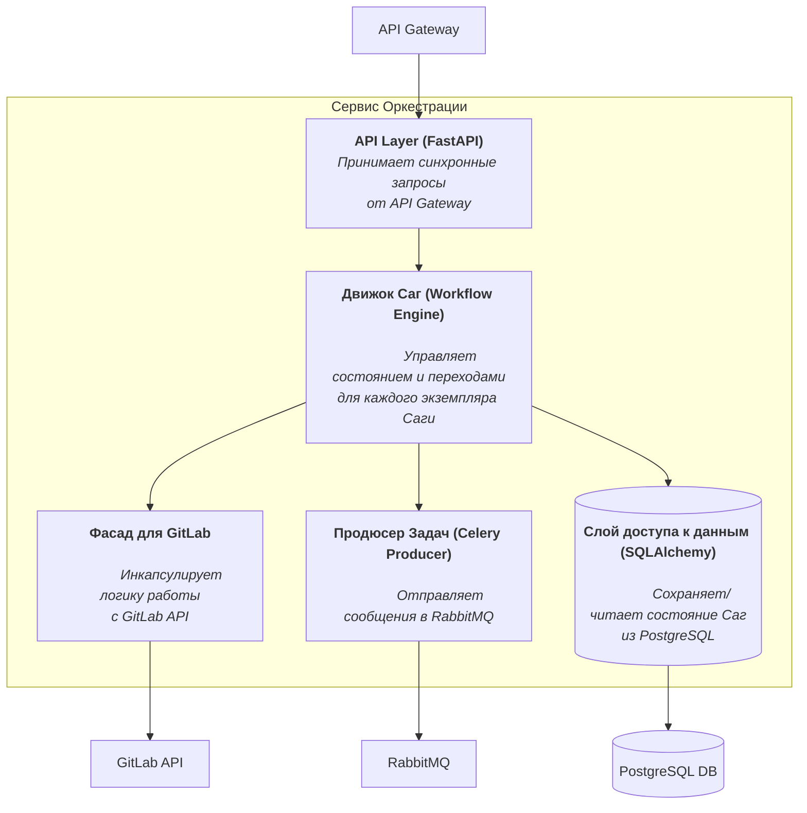
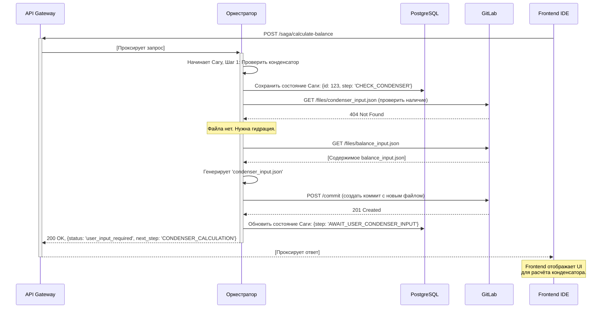

# **Описание сервиса: Сервис Оркестрации Задач**

**Версия:** 1.0  
**Статус:** Утверждено  
**Владелец:** Команда Backend

## 1. Роль и ответственность

Сервис Оркестрации Задач (далее — Оркестратор) является **"мозгом"** и **центральным координирующим ядром** системы "Balance+". В отличие от других сервисов, которые выполняют узкоспециализированные задачи, Ор-кестратор управляет сложными, долгоживущими бизнес-процессами.

Его ключевые зоны ответственности:
*   **Управление Workflow/Сагами:** Реализует логику многошаговых расчётов (например, "Расчёт Баланса"), управляет их состоянием и обеспечивает восстановление после сбоев.
*   **Фасад для GitLab:** Инкапсулирует всю логику взаимодействия с GitLab API (работа с задачами, ветками, файлами, MR), предоставляя остальной системе более высокоуровневый интерфейс.
*   **Продюсер Задач:** Является единственным сервисом, который отправляет (`produces`) сообщения-задачи в Message Broker для асинхронного выполнения `worker`-сервисами.

## 2. Архитектура и компоненты (C4 Model - Level 3: Components)

Оркестратор — это stateful-сервис. Его внутреннюю структуру можно разделить на несколько ключевых компонентов:



| Компонент | Описание |
| :--- | :--- |
| **API Layer** | Отвечает за прием HTTP-запросов, их валидацию (с помощью Pydantic) и передачу в Движок Саг. |
| **Движок Саг** | Ядро сервиса. Реализует логику state machine для каждого запущенного процесса. Определяет, какой шаг следующий: запросить данные у пользователя, выполнить действие в GitLab или отправить задачу в очередь. |
| **Фасад для GitLab** | Предоставляет внутренним компонентам простые методы, такие как `create_commit(files)`, `get_file_content(path)`, `create_merge_request()`. Вся сложность работы с GitLab API скрыта здесь. |
| **Продюсер Задач** | Отвечает за формирование и отправку сообщений-задач в RabbitMQ в соответствии с определенными контрактами. |
| **Слой доступа к данным** | Отвечает за сохранение и загрузку состояния экземпляров Саг в/из PostgreSQL. |

## 3. Ключевые сценарии и требования

### 3.1. Функциональные требования

| ID | Требование | Описание |
| :--- | :--- | :--- |
| **FR-ORCH-1** | **Управление Сагой "Расчёт Баланса"** | Реализует полный жизненный цикл Саги: инициация, последовательная проверка зависимостей, гидрация данных, запрос ввода от пользователя, синхронизация результатов и запуск финального расчёта. |
| **FR-ORCH-2** | **Персистентность Саг** | Состояние каждого экземпляра Саги (текущий шаг, контекст) должно храниться в PostgreSQL. Сервис должен уметь восстанавливать и продолжать прерванные процессы после перезапуска. |
| **FR-ORCH-3** | **Запуск простых расчётов** | Предоставляет API для запуска одиночных, независимых расчётов. При этом создается коммит с входными данными и отправляется одна задача в RabbitMQ. |
| **FR-ORCH-4** | **Управление задачами (Issues)** | Предоставляет API для Frontend, который возвращает список задач из GitLab, назначенных текущему пользователю. |
| **FR-ORCH-5** | **Управление геометрией** | Предоставляет API для чтения `geometries_manifest.json` и получения списка доступных геометрий. |
| **FR-ORCH-6** | **Создание Merge Request** | Предоставляет API для создания Merge Request в GitLab по завершении работы над задачей. |

### 3.2. Контракты данных

Оркестратор "владеет" контрактами асинхронных сообщений.

*   **Контракт сообщения-задачи (отправляется в RabbitMQ):**
    ```json
    {
      "correlationId": "uuid-for-tracing",
      "repoUrl": "http://gitlab.example.com/project.git",
      "branch": "issue/42-new-calculation",
      "commitHash": "a1b2c3d4e5f6...", // Хеш коммита, который нужно обработать
      "input_files": ["..."], // Список входных файлов
      "output_file": "..." // Имя ожидаемого выходного файла
    }
    ```

### 3.3. Нефункциональные требования

| ID | Требование | Описание |
| :--- | :--- | :--- |
| **NF-ORCH-1** | **Надежность** | Критически важное требование. Потеря состояния активной Саги недопустима. Все изменения состояния должны быть транзакционными. |
| **NF-ORCH-2** | **Идемпотентность** | Все операции, инициирующие действия (запуск Саги, создание MR), должны быть идемпотентными. |
| **NF-ORCH-3** | **Консистентность** | Сервис должен поддерживать консистентность между своим внутренним состоянием в БД и состоянием файлов в GitLab. |

## 4. Технологический стек

| Компонент | Технология | Обоснование |
| :--- | :--- | :--- |
| **Язык** | Python 3.10+ | Основной язык backend-разработки в проекте. |
| **Фреймворк API** | FastAPI | Для создания асинхронного API-слоя. |
| **Продюсер задач** | Celery (библиотека) | Для отправки задач в RabbitMQ. |
| **Workflow** | `python-statemachine` | Для декларативного описания логики Саг. |
| **СУБД** | PostgreSQL 14+ | Надежное хранилище для состояний Саг. |
| **ORM** | SQLAlchemy 2.0 + Alembic | Для работы с БД и управления миграциями. |
| **Клиент GitLab** | `python-gitlab` | Для удобной работы с GitLab API. |

## 5. Диаграмма последовательности: "Запуск Саги 'Расчёт Баланса'"

Эта диаграмма показывает первые шаги сложного сценария, включая гидрацию данных и запрос ввода от пользователя.


